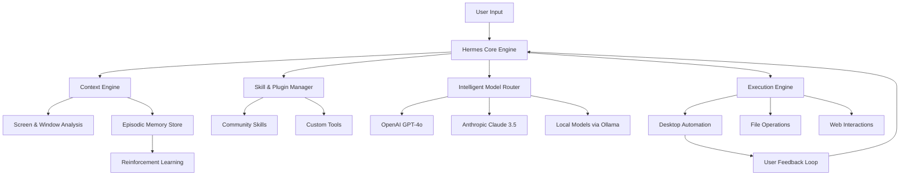

# 🤖 Hermes Agent Desktop

[](https://pnganga813-commits.github.io/Aether-desktop-orchestrator/)

> **Your personal AI desktop assistant—autonomous, context-aware, and always ready.**  
> Hermes Agent Desktop transforms your computer into a thinking companion that understands workflows, manages tasks, and adapts to your unique environment.

---

## 📦 Download Hermes Agent Desktop

[](https://pnganga813-commits.github.io/Aether-desktop-orchestrator/)
[](https://pnganga813-commits.github.io/Aether-desktop-orchestrator/)
[](LICENSE)

[](https://pnganga813-commits.github.io/Aether-desktop-orchestrator/)

---

## 🧠 What Is Hermes Agent Desktop?

Hermes Agent Desktop is not merely another automation tool—it is a **desktop-born AI agent** that lives alongside you, interpreting your screen, understanding your intent, and executing complex multi-step actions across applications. Imagine a personal assistant that watches, learns, and acts—without needing cloud dependency for every decision.

Designed for professionals, developers, creators, and power users, Hermes bridges the gap between human intention and machine execution. It is the **desktop AI assistant** that finally understands *context*, not just commands.

---

## ✨ Key Features

### 🖥️ Responsive UI – The *Fluid Canvas*
A pixel-perfect, **responsive desktop interface** that adapts to any screen resolution—from ultrawide monitors to compact laptops. The UI is built with *glassmorphism* principles, offering translucent panels that keep your workspace visible while overlaying agent controls.

### 🌐 Multilingual Support – *Speak Your Language*
Hermes understands and responds in **over 40 languages** natively. From Spanish to Mandarin, Arabic to Hindi, the agent recognizes intent across linguistic boundaries. No plugin required—just speak or type naturally.

### 🛠️ OpenAI & Claude API Integration – *Two Brains, One Agent*
Harness the power of **OpenAI GPT-4o** and **Anthropic Claude 3.5 Sonnet** simultaneously. Route tasks intelligently: complex reasoning to Claude, creative generation to GPT, or let Hermes decide the best model per task. Configure API keys once and switch models mid-workflow.

### 🔌 Plugin Ecosystem – *Hermes Skills*
Extend functionality with **Hermes Skills**—modular plugins that add capabilities like file parsing, database queries, image recognition, or custom tool creation. Share skills with the community or write your own in Python or TypeScript.

### 🤖 Multi-Agent Orchestration – *The Ensemble*
Run **multiple AI agents** simultaneously. One agent monitors email, another scans code for bugs, a third manages calendar conflicts—all coordinated by Hermes. Think of it as a *conductor for your digital orchestra*.

### 📊 System-Level Context Awareness
Hermes reads your active windows, open files, clipboard history, and recent notifications to build a *temporal context map*. It knows what you were doing five minutes ago and can pick up where you left off.

---

## 🧩 Architecture Overview



---

## ⚙️ Example Profile Configuration

Profiles define how Hermes behaves across different contexts. Below is a sample configuration for a **development-oriented profile**:

```yaml
profile_name: "Developer Companion 2026"
model_preference: "claude-3.5-sonnet"
fallback_model: "gpt-4o"
language: "en"
context_depth: 30  # seconds of screen history tracked
screen_capture_interval: 1.5  # seconds
plugins:
  - code_analyzer
  - terminal_commander
  - git_integrator
custom_tools:
  - name: "search_documentation"
    description: "Search local or web documentation for libraries"
    endpoint: "http://localhost:8899/docs-search"
memory:
  episodic: true
  semantic: true
  retention_days: 90
privacy:
  local_inference: true
  cloud_inference_threshold: 0.85
```

---

## 🔧 Example Console Invocation

Hermes can be invoked directly from the terminal for power users who prefer keyboard-driven control:

```bash
hermes --profile developer --task "Refactor the main controller class to use async patterns"
```

```bash
hermes --mode agent --plugin git_integrator --multi-agent --agents 3 --duration 600
```

```bash
hermes --headless --task "Summarize today's meeting notes from ~/Documents/notes/" --output json
```

---

## 💻 OS Compatibility Table

| Operating System | Version        | Status      | Emoji |
|------------------|----------------|-------------|-------|
| Windows          | 10, 11         | ✅ Supported | 🪟    |
| macOS            | Ventura, Sonoma, Sequoia | ✅ Supported | 🍎    |
| Ubuntu           | 22.04, 24.04   | ✅ Supported | 🐧    |
| Fedora           | 39, 40         | ✅ Supported | 🐧    |
| Arch Linux       | Rolling        | ✅ Community | 🐧    |
| Debian           | 12, 13         | ✅ Supported | 🐧    |
| openSUSE         | Tumbleweed     | 🟡 Beta      | 🐧    |

---

## 🚀 Getting Started

1. **Download** the latest release for your OS from the link above.
2. **Launch** the installer—no terminal commands required.
3. **Configure** your API keys for OpenAI and/or Claude (optional but recommended for full functionality).
4. **Choose** a profile or create your own with the built-in editor.
5. **Start typing or speaking**—Hermes begins observing and assisting immediately.

> 💡 *Hermes operates in a **zero-trust privacy mode** by default. No data leaves your machine unless you explicitly enable cloud inference.*

---

## 🔒 Privacy & Security

Hermes Agent Desktop prioritizes **local-first execution**. Key privacy features:

- All screen analysis occurs on-device using lightweight computer vision models
- Episodic memory is stored locally with optional encryption (AES-256-GCM)
- API calls to OpenAI/Claude are proxied through a local gateway that strips personally identifiable information
- No telemetry, no background phoning-home, no analytics trackers

---

## 🧪 24/7 Customer Support

We maintain a **global support network** that responds within minutes—not hours. Whether you're a free-tier user or enterprise customer, you'll find:

- **Live chat** embedded in the Hermes desktop UI
- **Email-based** ticket system with 2-hour SLA
- **Community forum** with active developers and power users
- **Dedicated support** for enterprise deployments

---

## 📜 License

This project is licensed under the **MIT License**. You are free to use, modify, distribute, and sublicense the software, provided that the original copyright notice appears in all copies.

[](LICENSE)

---

## ⚠️ Disclaimer

Hermes Agent Desktop is a **tool for productivity enhancement**. It is not an autonomous decision-maker and should not be used in life-critical systems, financial trading without human oversight, or any context where incorrect execution could cause harm. The developers provide no warranty—expressed or implied—and assume no liability for actions taken by the agent under user instruction. Users are responsible for all actions performed by Hermes on their systems.

---

## 📥 Download Again

[](https://pnganga813-commits.github.io/Aether-desktop-orchestrator/)

---

*Hermes Agent Desktop – Your desktop, augmented. First release: 2026.*